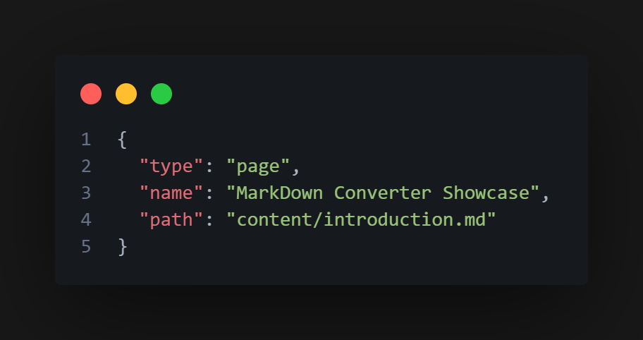
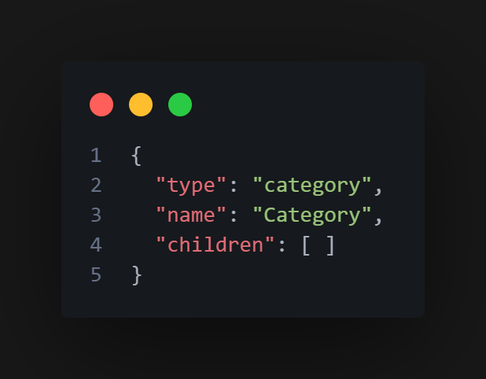
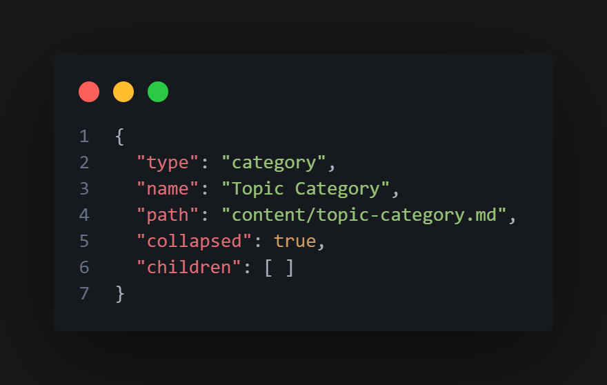

# How to Create Documentation

This guide outlines the steps required to create documentation effectively.

## Creating Pages

Follow these steps to create a new page:

1. Create a new `.md` file and write the content using Markdown. You can utilize the custom tags provided by the [MarkDown Converter](https://github.com/MarkusHarnusek/MarkDownConverter). For examples of various tags, refer to `assets/content/introduction.md` and view them in action on the initial page of the documentation template.
2. Add the `#end` tag at the end of each page.
3. Save the file in the `assets/content/` directory.

## Categorizing Pages

Pages and categories are configured in the `assets/content-structure.json` file. Each child entry represents either a page or a category, and they follow a similar structure.

### Page Configuration
- **type**: `page`
- **name**: The visible name of the page.
- **path**: The file path, e.g., `content/<file-name>.md`.

**Example Page:**

### Category Configuration
- **type**: `category`
- **name**: The visible name of the category.
- **children**: A list of child pages or categories.

**Example Category:**

### Topic Category Configuration
A topic category contains subpages for deeper nesting.

- **type**: `category`
- **name**: The visible name of the topic category.
- **collapsed**: `true` if initially collapsed, `false` if expanded.
- **children**: A list of child pages or categories.

**Example Topic Category:**

